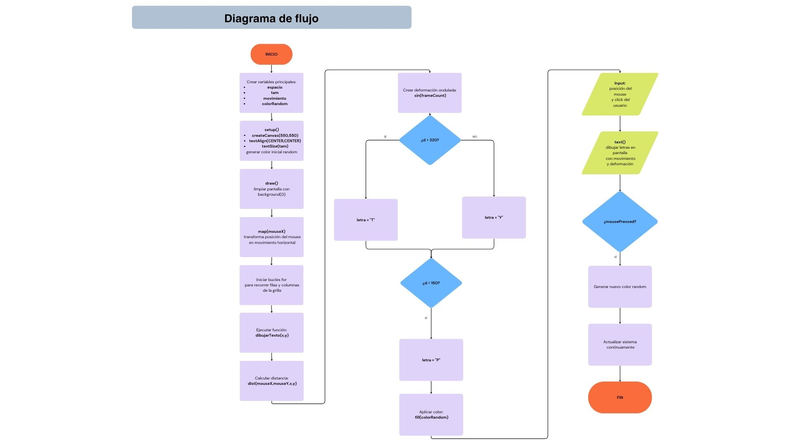

# Solemne2

## Información del Proyecto 

- **Nombre del proyecto:** RM Mono type animations by John Burgess - Poster for Amsterdam Sinfonietta's 
- **Autor:** John Burgess - Stan Haanappel

  
## Descripción objetiva

- ### Qué es el proyecto
El proyecto consiste en una composición visual interactiva inspirada en el arte cinético y el Op Art tipográfico, desarrollada mediante programación en p5.js. La obra busca generar una sensación de movimiento, profundidad y distorsión visual a través de patrones repetitivos y comportamiento reactivo en tiempo real.El proyecto consiste en una composición visual interactiva inspirada en el arte cinético y el Op Art tipográfico, desarrollada mediante programación en p5.js. La obra busca generar una sensación de movimiento, profundidad y distorsión visual a través de patrones repetitivos y comportamiento reactivo en tiempo real.
  
- ### Qué se ve en pantalla
En pantalla se observa una grilla formada por múltiples letras distribuidas de manera uniforme sobre un fondo negro. Estas letras no permanecen estáticas, sino que se deforman y desplazan constantemente mediante movimientos ondulados generados con funciones matemáticas. Además, la composición cambia dependiendo de la posición del mouse, provocando que las letras reaccionen y transformen su comportamiento visual según la cercanía del cursor.

- ### Qué elementos visuales aparecen
— patrones tipográficos repetitivos organizados en una grilla,

— movimiento horizontal interactivo,

— deformaciones onduladas inspiradas en efectos ópticos,

— cambios de letras mediante condicionales,

— variaciones de color generadas aleatoriamente al hacer click, y una estética de alto contraste entre colores brillantes y fondo negro para reforzar la sensación cinética y visual.

- ### Qué inputs utiliza
El proyecto utiliza principalmente inputs generados por la interacción del usuario y por funciones internas del sistema.

Los inputs principales son:

— mouseX → detecta la posición horizontal del mouse.

— mouseY → detecta la posición vertical del mouse.

— mousePressed() → detecta cuando el usuario hace click.

— frameCount → registra la cantidad de cuadros del sistema para generar movimiento continuo.

— random() → genera valores aleatorios para los cambios de color.

Estos inputs permiten que la composición reaccione en tiempo real y modifique su comportamiento visual constantemente.

- ### Qué outputs genera
El proyecto genera outputs visuales dinámicos en pantalla.

Los outputs principales son:

— una grilla tipográfica compuesta por letras,

— movimiento horizontal reactivo al mouse,

— deformaciones onduladas cinéticas,

— cambios de letras según la distancia del cursor,

— variaciones de color aleatorias,

— patrones visuales en constante transformación,

— y una composición interactiva inspirada en el arte óptico y cinético.

El resultado final es una experiencia visual dinámica donde el usuario modifica la obra mediante el movimiento e interacción con el mouse.

## Descripción conceptual

- ### Idea central del proyecto
La idea central del proyecto es crear una experiencia visual interactiva inspirada en el arte cinético y el Op Art, a través del movimiento, distorsión y cambios visuales en tiempo real.

El sistema transforma una grilla tipográfica en una composición dinámica que reacciona constantemente al movimiento del usuario. A través de patrones repetitivos, deformaciones onduladas y variaciones de color, la obra busca generar efectos ópticos de vibración, profundidad y desplazamiento visual.

Además, el proyecto explora cómo elementos simples, como letras repetidas, pueden convertirse en una composición compleja mediante reglas matemáticas, interacción y movimiento continuo.

- ### Corriente o referente de diseño con el que dialoga
El proyecto dialoga principalmente con:

— el Arte Cinético, por el uso de movimiento visual y sensación de dinamismo;

— y el Op Art, debido a la utilización de repetición, patrones geométricos y efectos ópticos que alteran la percepción visual.

- ### Listado y breve descripción de referentes visuales, teóricos o históricos
**Arte Cinético**

Corriente artística que busca generar sensación de movimiento real o visual mediante formas repetitivas, contrastes y variaciones ópticas. El proyecto toma esta idea para crear desplazamientos y deformaciones dinámicas en tiempo real.

**Op Art**

Movimiento artístico centrado en ilusiones ópticas y patrones geométricos repetitivos. La utilización de una grilla tipográfica repetitiva y las deformaciones onduladas se inspiran directamente en este tipo de composiciones visuales.

**Arte Generativo**

Práctica artística basada en sistemas, algoritmos y reglas programadas. El proyecto utiliza código como herramienta de creación visual, permitiendo que la composición cambie continuamente mediante cálculos matemáticos e interacción.

**Diseño Tipográfico Experimental**

El proyecto utiliza letras como elementos visuales modulares, alejándose de su función únicamente textual para convertirlas en patrones gráficos y estructuras dinámicas.

- ### Principio de diseño explorado
El proyecto explora principalmente los siguientes principios de diseño:

— **Repetición:** utilización continua de letras organizadas en una grilla.

— **Movimiento:** desplazamientos ondulados y reacción al mouse.

— **Contraste:** uso de colores brillantes sobre fondo negro.

— **Ritmo visual:** patrones repetitivos que generan continuidad visual.

— **Variación:** cambios de letras, color y deformación según la interacción.

— **Interactividad:** el usuario modifica la composición mediante el movimiento y el click del mouse.

— **Unidad visual:** todos los elementos funcionan como parte de un mismo sistema dinámico.

## Input / Output y sistema

- ### Reglas que gobiernan el sistema

**Inputs**

Los datos que ingresan al sistema son:

**mouseX** → posición horizontal del mouse.
**mouseY** → posición vertical del mouse.
**mousePressed()** → click del usuario.
**frameCount** → contador interno de cuadros.
**random()** → generación de valores aleatorios.

**Procesos**

El sistema procesa los datos mediante:

— funciones matemáticas,

— mapeos,

— cálculos de distancia,

— condicionales,

— y bucles repetitivos.

Las principales reglas del sistema son:

— map(mouseX) transforma el movimiento del mouse en desplazamiento horizontal.

— dist() calcula la cercanía entre el cursor y cada letra.

— sin(frameCount) genera deformaciones onduladas continuas.

— los if cambian las letras dependiendo de la distancia al mouse.

— los bucles for recorren toda la grilla para actualizar cada elemento visual.

— random() genera nuevos colores cuando el usuario hace click.

**Outputs**

El sistema produce distintos outputs visuales:

— movimiento cinético,

— deformaciones onduladas,

— cambios tipográficos,

— desplazamientos interactivos,

— variaciones de color,

— y patrones visuales dinámicos.

- ### Explicación del sistema de interactividad
La interactividad del proyecto depende completamente de la relación entre el usuario y el sistema visual.

Cuando el usuario mueve el mouse:

— la posición del cursor modifica el desplazamiento de las letras;

— también altera la distancia calculada entre el mouse y cada elemento;

— esto provoca cambios en el movimiento, deformación y tipo de letra que aparece en pantalla.

Cuando el usuario hace click:

— el sistema genera un nuevo color aleatorio;

— automáticamente todas las letras cambian de color.

- ### Qué datos entran
Los datos de entrada son:

— coordenadas del mouse (mouseX, mouseY);

— clicks del usuario;

— tiempo interno del sistema (frameCount);

— y valores aleatorios generados por random().

- ### Cómo se procesan y transforman
Los datos son transformados mediante:

— map() para convertir movimientos en desplazamientos;

— dist() para calcular cercanía;

— sin() para generar ondas;

— condicionales if para cambiar letras;

— y bucles for para actualizar toda la grilla.

- ### Qué respuesta visual producen
La respuesta visual producida por el sistema es:

— una grilla tipográfica dinámica;

— movimiento ondulado continuo;

— deformaciones ópticas;

— cambios de letras;

— desplazamientos interactivos;

— y cambios de color aleatorios.

## Diagrama de flujo

## Link Sketch

https://editor.p5js.org/marina.cossio/sketches/VN4xDqIZT
